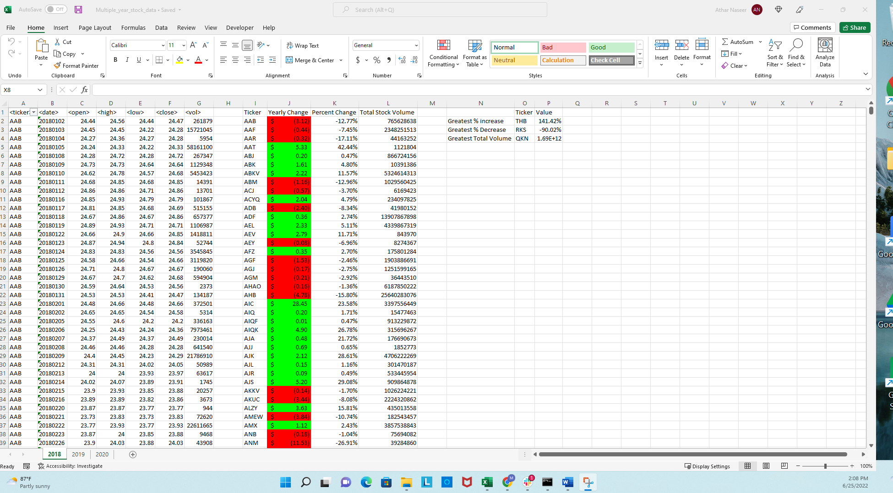
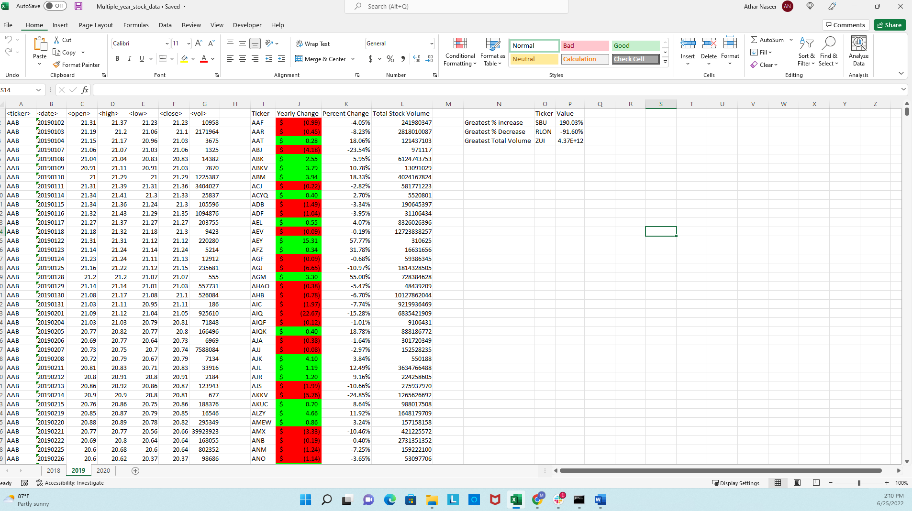
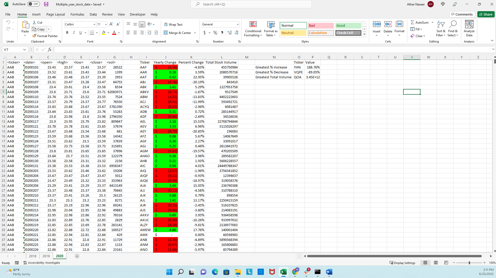

# Stock Market Data Using Visual Basic for Applications (VBA) 

##Description:

In this Module Challenge, we're developing a VBA script to analyze generated stock market data. VBA (Visual Basic for Applications) is Microsoft's programming language for Excel,Word and Powerpoint. We've leveraged VBA to calculate a number of things in the Stock Market data set provided.  

###*** ***Goals:

To Create a script that loops through all the stocks for one year and outputs the following information:

  1) The ticker symbol.

  2) Yearly change from opening price at the beginning of a given year to the closing price at the end of that year.

  3)The percent change from opening price at the beginning of a given year to the closing price at the end of that year.

  4)The total stock volume of the stock.
  
  5)To use conditional formatting that will highlight positive change in green and negative change in red.
  
  6)For the Bonus part: To calculate the stock in order to print out the "Greatest % increase", "Greatest % decrease", and "Greatest total volume". And make the VBA script run on every worksheet (that is, every year) just by running it once.

 
  ###Files uploaded:

  1)The Completed Excel Workbook for the Multiple Year Stock Data as "Multiple_year_stock_data.xlsm"
  2)The VBS code script used for the Multiple Year stock data as "Module_of_Multiple_year_stock_data.vbs"
  3) The screenshots of the year 2018-2020 , as "2018.png", "2019.png" and "2020.png". 

  ##Analysis:

  When you open up the data sheet i.e "Multiple_year_stock_data.xlsm". All the values are calculated and added to the sheet using the VBA script ("Module_of_Multiple_year_stock_data.vbs"). The script runs through all the sheets in one run command. I have assigned variables and used a for loop to find the tickers and their respective sum of total stock volumes, calculated the yearly change and  percent change. Also, for finding the greatest % change, greatest % decrease and greatest total stock volume, I have used the max and min functions and ran it through each worksheet in the workbook.  From the data we can see the greatest percent increase and the greatest total volumne in stock was in the year 2019. The greatest percent decrease averaged about 90.2 % and remained rather consistent in the 3 years. The greatest total stock volume decreased by a large amount in 2020 as compared to 2019. The year 2019 was a the year of the Stock Market!   

  

